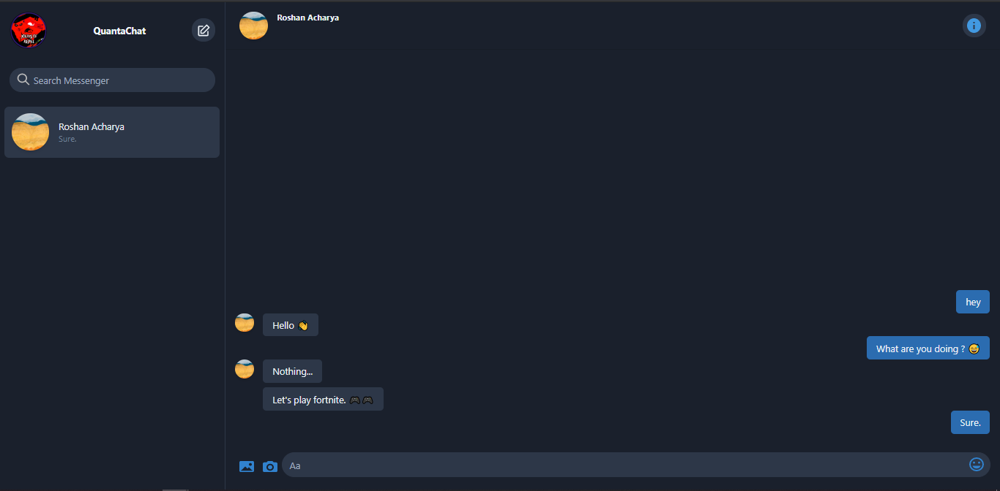

# Quickstart

- `git clone https://github.com/acharyaroshanji/QuantaChat.git`
- `cd QuantaChat`
- `yarn install`
- `cd client`
- `yarn install`
- `yarn build:css`
- make .env file with the content of .env.example
- `yarn develop`

# Build

- `yarn build`
